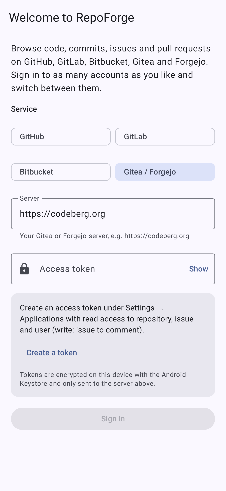
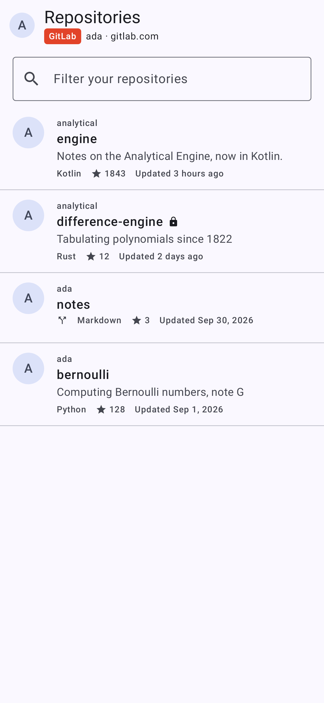
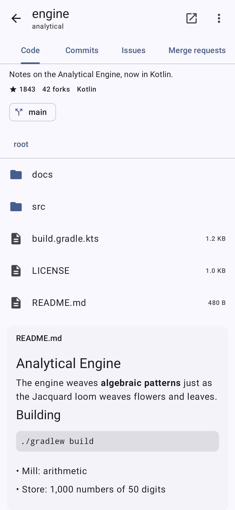
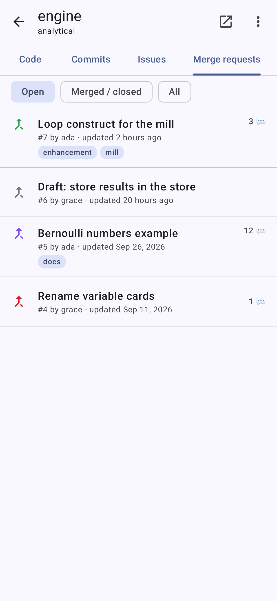
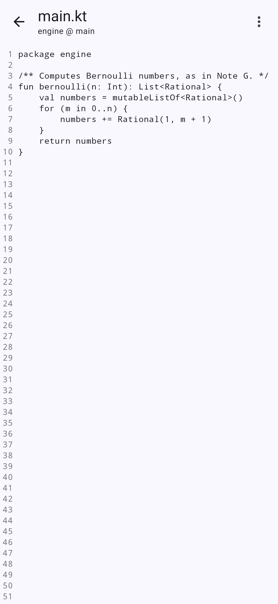
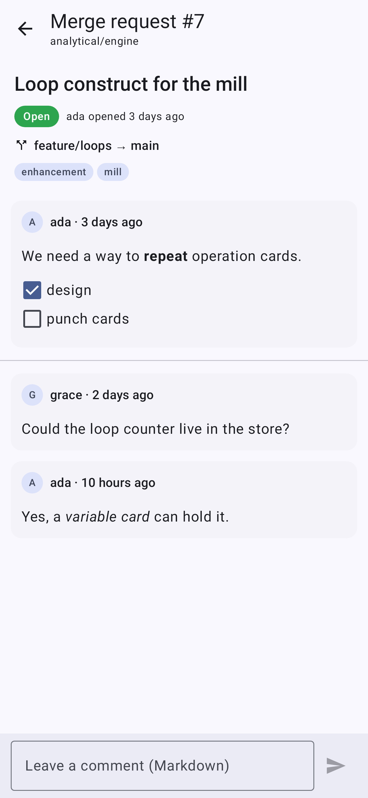

# RepoForge

A native Android client for **GitHub, GitLab, Bitbucket, Gitea and Forgejo** (including Codeberg).
Sign in to as many accounts as you like, on public or self-hosted servers, and switch between them.

| Sign in | Repositories | Code | Merge requests | File | Discussion |
|---|---|---|---|---|---|
|  |  |  |  |  |  |

## Features

- **Accounts** for GitHub.com and GitHub Enterprise, GitLab.com and self-managed GitLab, Bitbucket Cloud,
  and any Gitea or Forgejo server. Tokens are encrypted with the Android Keystore.
- **Repositories**: your repositories, an instant filter, and server-wide search.
- **Code**: browse folders on any branch, view files with line numbers, rendered Markdown, images,
  and the README for each folder. Copy clone URLs or open anything in the browser.
- **Commits** per branch.
- **Issues and pull/merge requests**: filter by state, read the discussion, post comments, open new issues.

## Signing in

RepoForge uses personal access tokens, so no OAuth app has to be registered for self-hosted servers.
The sign-in screen links to the right page on each service:

| Service | Token | Scopes |
|---|---|---|
| GitHub | Personal access token (classic or fine-grained) | `repo`, `read:org`, `read:user` |
| GitLab | Personal access token | `api` (or `read_api` to browse only) |
| Bitbucket Cloud | Atlassian API token + your Atlassian e-mail | `read:user`, `read:workspace`, `read:repository`, `read:pullrequest`, `read:issue` (+ `write:issue` / `write:pullrequest` to comment) |
| Gitea / Forgejo | Access token (Settings → Applications) | read repository, issue, user (+ write issue to comment) |

Servers with a private or self-signed certificate work once their CA certificate is installed on the
device (Settings → Security → Encryption & credentials → Install a certificate).

## Building

Requires JDK 17+ and the Android SDK with platform 37 (Android 17).

```sh
./gradlew assembleDebug          # app/build/outputs/apk/debug/app-debug.apk
./gradlew testDebugUnitTest      # API client tests against a mock server
./gradlew testDebugUnitTest -Plive          # smoke tests against the real services
./gradlew testDebugUnitTest -Pscreenshots   # re-render app/screenshots with Robolectric
```

Dependencies resolve through Google's Maven Central mirror first, falling back to Maven Central.
