# RepoForge

A native Android client for **GitHub, GitLab, Bitbucket, Gitea and Forgejo** (including Codeberg).
Sign in to as many accounts as you like, on public or self-hosted servers, and switch between them.

| Sign in | Repositories | Code | Commit |
|---|---|---|---|
| 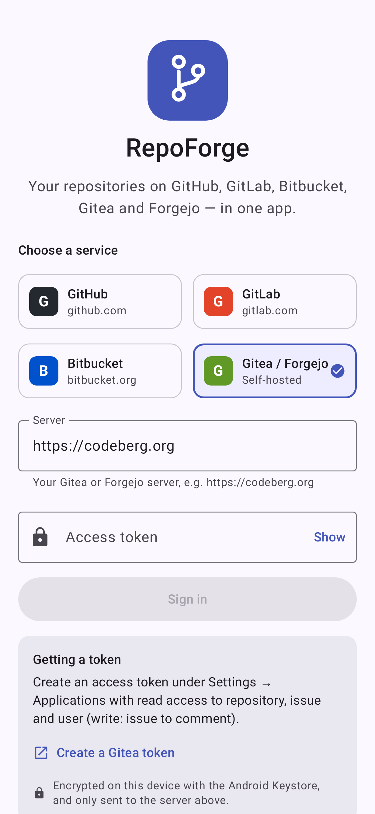 | 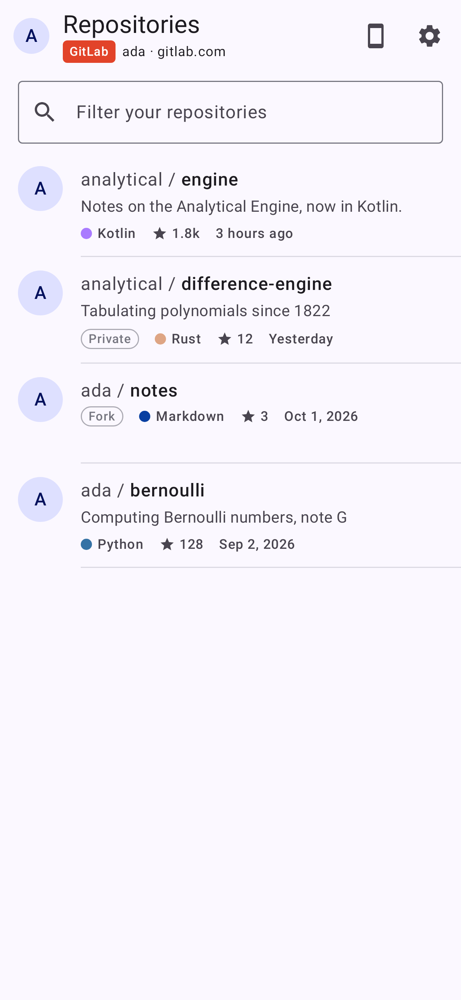 | 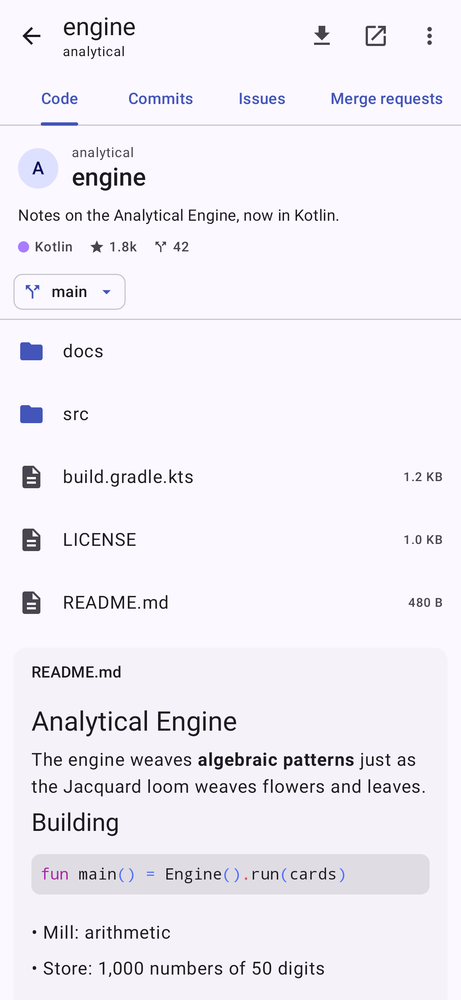 | 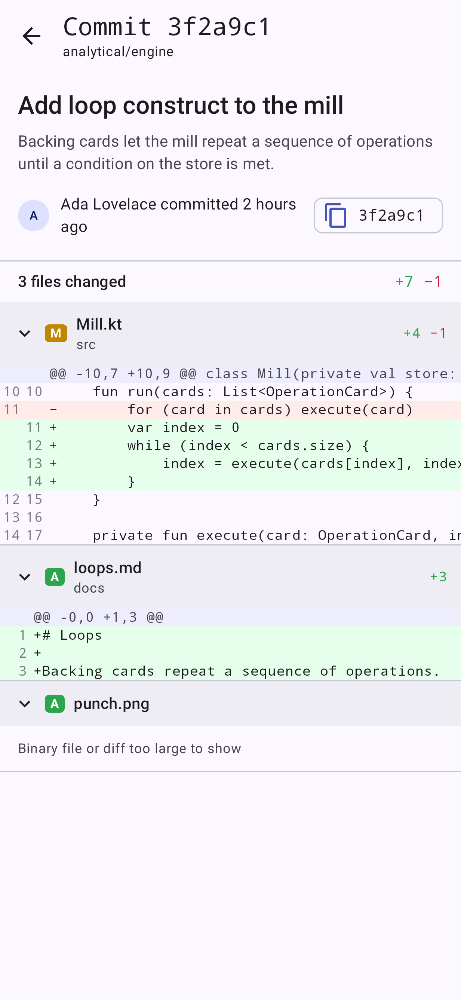 |
| **Merge request** | **Files changed** | **File** | **Dark theme** |
| 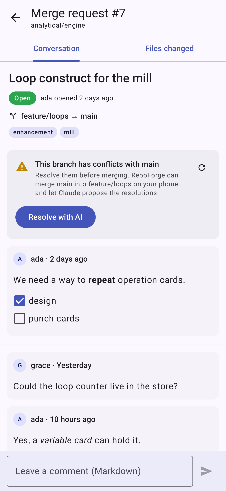 | 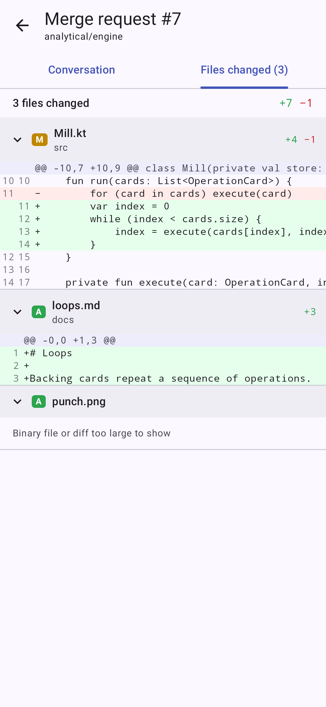 | 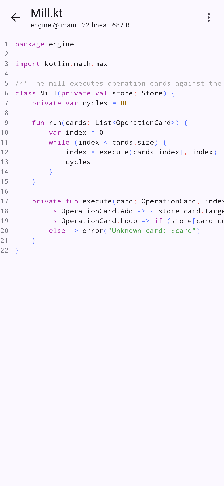 | 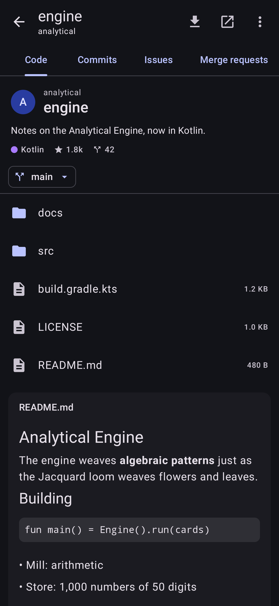 |
| **Resolve conflicts with Claude** | **Clone on the phone** | **Working copy files** | **Settings** |
| 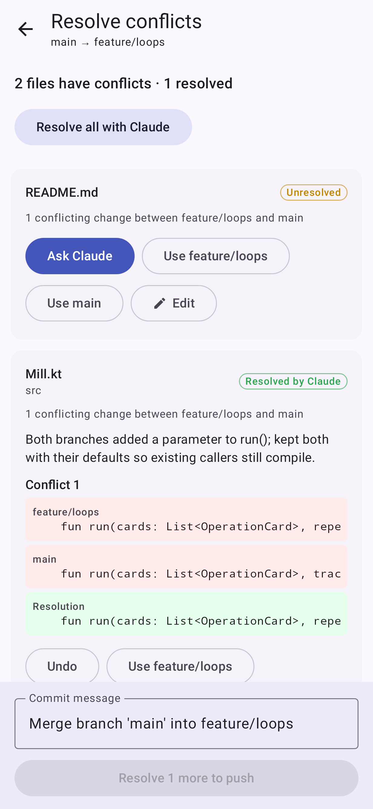 | 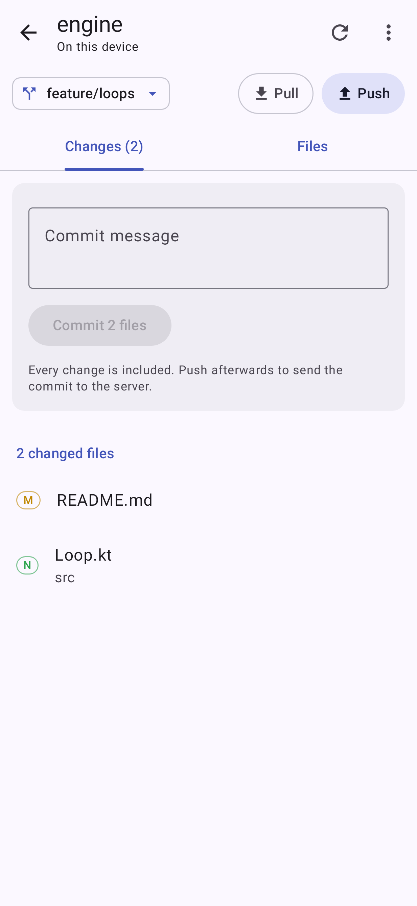 | 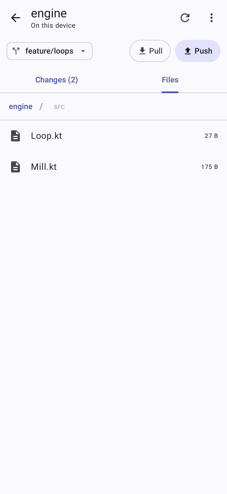 | 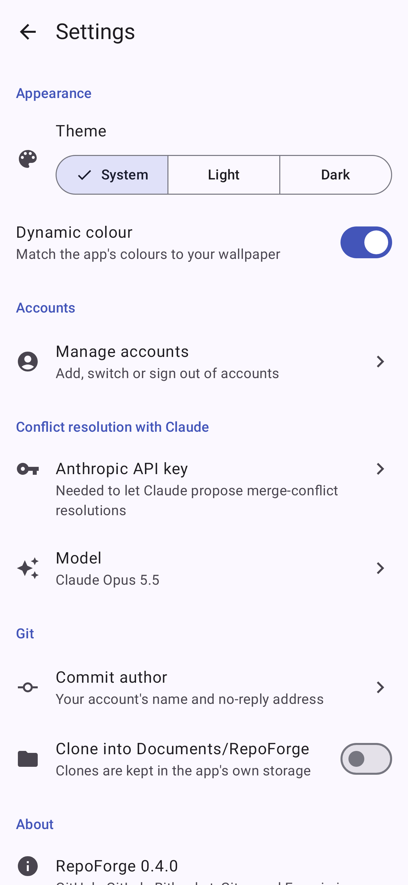 |
| **CI runs** | **Jobs and artifacts** | **Job log** | **Job log (dark)** |
| 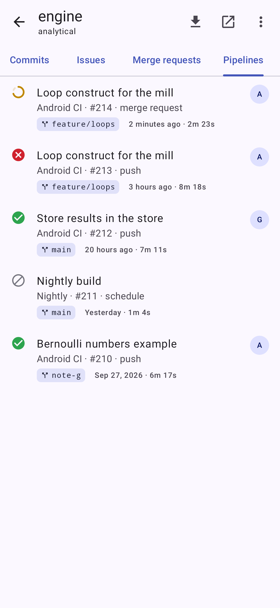 | 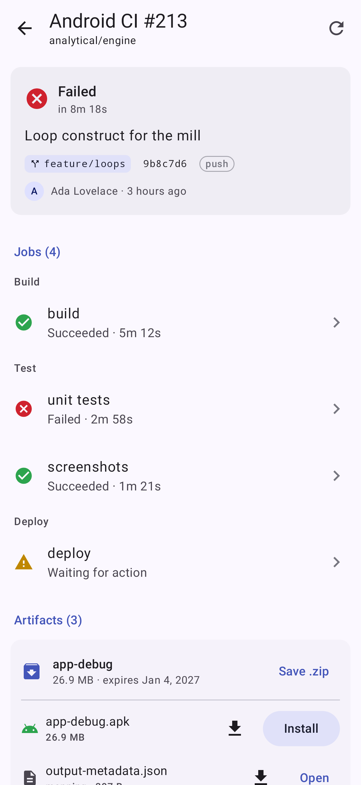 | 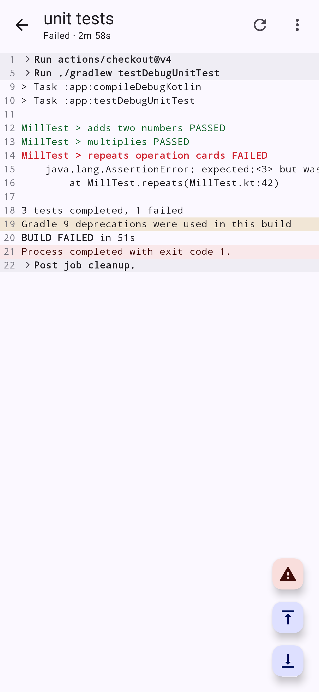 | 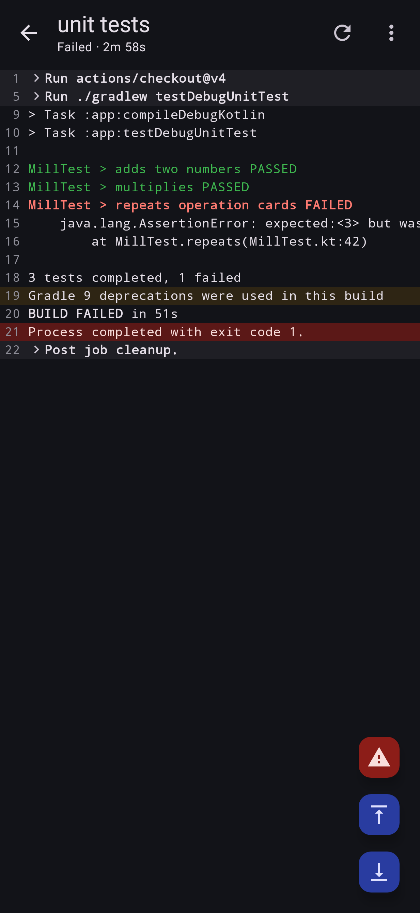 |

## Features

- **Accounts** for GitHub.com and GitHub Enterprise, GitLab.com and self-managed GitLab, Bitbucket Cloud,
  and any Gitea or Forgejo server. Tokens are encrypted with the Android Keystore.
- **Repositories**: your repositories with language, stars and visibility at a glance, an instant filter,
  and server-wide search.
- **Code**: browse folders on any branch, syntax-highlighted files with line numbers, rendered Markdown
  (with highlighted code blocks and relative images), zoomable images, and each folder's README.
- **Commits** per branch, each with its full message and a colour-coded diff.
- **Issues and pull/merge requests**: filter by state, read the discussion, review the changed files,
  post comments and open new issues.
- **Merge pull/merge requests** with any method the service supports (merge commit, squash, rebase,
  fast-forward), and **delete the branch** as part of the merge or afterwards.
- **Resolve merge conflicts with AI**: when a pull request conflicts with its base branch, RepoForge merges
  the base into the pull request branch on the phone and asks Claude to resolve each conflict. Review every
  proposed resolution next to both sides, accept it, pick a side, or edit the file yourself, then push the
  merge commit to the pull request branch (including branches in forks). Needs an Anthropic API key in Settings.
- **Clone repositories onto the phone** over HTTPS with your account's token. Each clone shows its changes,
  lets you edit files, commit, pull, push and switch branches. Clones live in app storage, or in
  Documents/RepoForge (with "All files access") so other apps can open them.
- **CI**: GitHub Actions, GitLab pipelines, Bitbucket Pipelines and Gitea/Forgejo Actions in each repository's
  Actions/Pipelines tab. Runs update live while they're in progress; each shows its jobs (with steps or stages)
  and opens a job's log with collapsible groups, ANSI colours, and a jump to the first error.
- **Download artifacts** to the phone, look inside the zip, save it or any file in it to Downloads, open files,
  and **install APKs** built by CI straight from the run. (Bitbucket doesn't offer artifacts through its API.)
- **Light, dark or system theme**, with Material You dynamic colour on Android 12+.

## Signing in

RepoForge uses personal access tokens, so no OAuth app has to be registered for self-hosted servers.
The sign-in screen links to the right page on each service:

| Service | Token | Scopes |
|---|---|---|
| GitHub | Personal access token (classic or fine-grained) | `repo`, `read:org`, `read:user` (fine-grained: also Actions read for CI) |
| GitLab | Personal access token | `api` (or `read_api` to browse only) |
| Bitbucket Cloud | Atlassian API token + your Atlassian e-mail | `read:user`, `read:workspace`, `read:repository`, `read:pullrequest`, `read:issue`, `read:pipeline` (+ `write:issue` / `write:pullrequest` to comment and merge, `write:repository` to push and delete branches) |
| Gitea / Forgejo | Access token (Settings → Applications) | read repository, issue, user (+ write issue and repository to comment, merge and push) |

### AI conflict resolution

Add an [Anthropic API key](https://console.anthropic.com/settings/keys) under Settings → Conflict resolution
with Claude, and pick a model (Claude Opus 5.5 by default; Sonnet 5.5 and Haiku 5.5 are faster and cheaper).
The key is encrypted with the Android Keystore. Only the conflicting file, its common ancestor and the pull
request's title and description are sent, and nothing is pushed until you have reviewed every file.

Servers with a private or self-signed certificate work once their CA certificate is installed on the
device (Settings → Security → Encryption & credentials → Install a certificate).

## Building

Requires JDK 17+ and the Android SDK with platform 37 (Android 17).

```sh
./gradlew assembleDebug          # app/build/outputs/apk/debug/app-debug.apk
./gradlew testDebugUnitTest      # API client, git and Claude tests against local servers
./gradlew testDebugUnitTest -Plive          # smoke tests against the real services
./gradlew testDebugUnitTest -Pscreenshots   # re-render app/screenshots with Robolectric
```

Dependencies resolve through Google's Maven Central mirror first, falling back to Maven Central.
